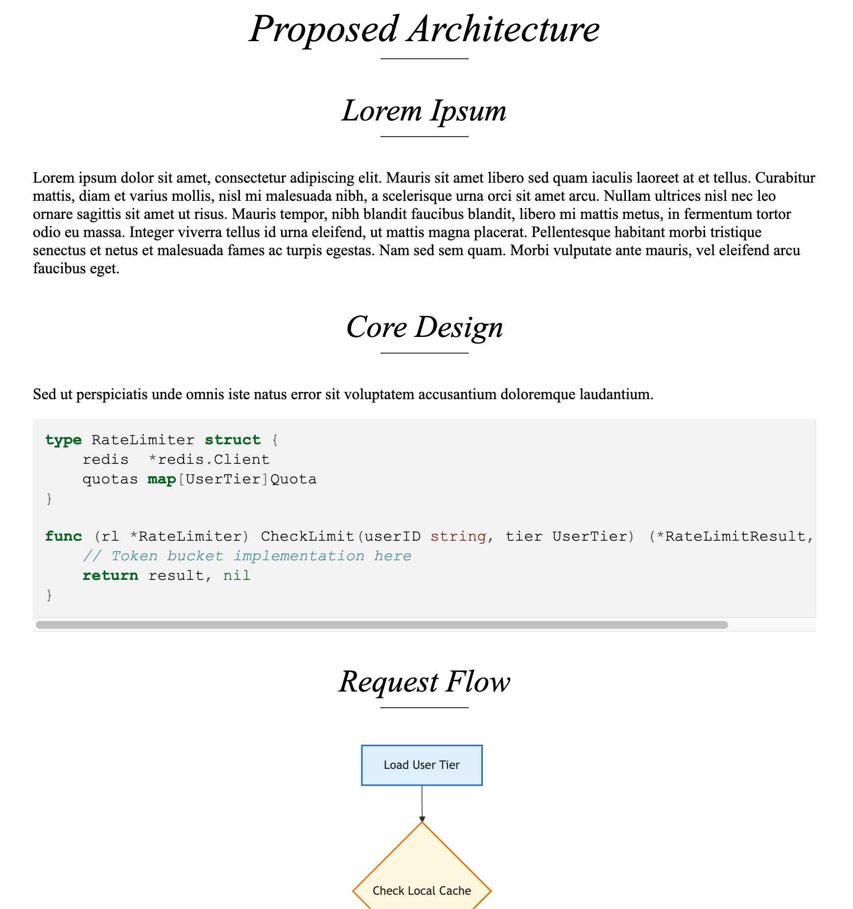

# Pretty Markdown

## Overview
This is essentially a wrapper around [pandoc](https://github.com/jgm/pandoc) for Markdown files, with quality of life improvements during both the writing and viewing phases.
The primary use case is technical design docs that may benefit from diagrams and code snippets.

## Features
- Live preview of Markdown files in your browser.
- Support for Mermaid diagrams.
- Syntax highlighting for code blocks.
- Horizontal scroll for wide code blocks.
- Converts Markdown to a standalone HTML file.

## Installation
1. Install Chrome and Nix. Chrome is a dependency for the tool that renders Mermaid diagrams.
2. Clone this repository.
3. Run `nix develop`.

## Usage
From within this repository, run:
```bash
just watch /path/to/your/file.md
```
The output HTML file will be `/path/to/your/file.html`.
The HTML file will open in your browser and automatically refresh when changes are saved to the Markdown file.

## At a Glance
See the example below:

