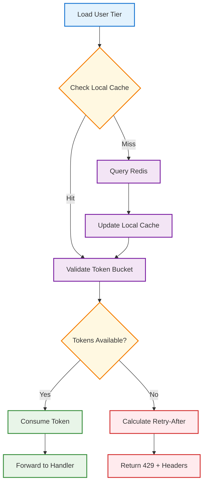

# Lorem Ipsum

## Overview

Lorem ipsum dolor sit amet, consectetur adipiscing elit. Sed do eiusmod tempor incididunt ut labore et dolore magna aliqua.

## Tenets

- **Performance**: Quisque quis neque eget dolor sodales tempus.
- **Simplicity**: Mauris sed tristique enim.
- **Low Maintenance**: Maecenas luctus pulvinar metus non hendrerit.

## Proposed Architecture
### Lorem Ipsum

Lorem ipsum dolor sit amet, consectetur adipiscing elit. Mauris sit amet libero sed quam iaculis laoreet at et tellus. Curabitur mattis, diam et varius mollis, nisl mi malesuada nibh, a scelerisque urna orci sit amet arcu. Nullam ultrices nisl nec leo ornare sagittis sit amet ut risus. Mauris tempor, nibh blandit faucibus blandit, libero mi mattis metus, in fermentum tortor odio eu massa. Integer viverra tellus id urna eleifend, ut mattis magna placerat. Pellentesque habitant morbi tristique senectus et netus et malesuada fames ac turpis egestas. Nam sed sem quam. Morbi vulputate ante mauris, vel eleifend arcu faucibus eget.

### Core Design

Sed ut perspiciatis unde omnis iste natus error sit voluptatem accusantium doloremque laudantium.

```go
type RateLimiter struct {
    redis  *redis.Client
    quotas map[UserTier]Quota
}

func (rl *RateLimiter) CheckLimit(userID string, tier UserTier) (*RateLimitResult, error) {
    // Token bucket implementation here
    return result, nil
}
```

### Request Flow

<div style="max-width: 45%; margin: 0 auto;">

</div>

## Conclusion
Vestibulum ultricies at lorem ac sagittis. Nam ut eros id risus condimentum volutpat. In sit amet nibh in tortor ornare vehicula in ac neque. Nam nulla sem, placerat ut augue volutpat, tincidunt tempus neque. Morbi a sagittis lacus. Cras tempor sapien felis. Curabitur tellus lorem, vehicula non mi in, posuere aliquam dolor. Nulla urna quam, condimentum et venenatis vitae, maximus in tortor. Sed sed bibendum dui, non tincidunt purus. In sagittis, erat sit amet ornare sagittis, libero nisl hendrerit lectus, a dictum orci nisl eu arcu. Proin elementum purus vel hendrerit consequat.
